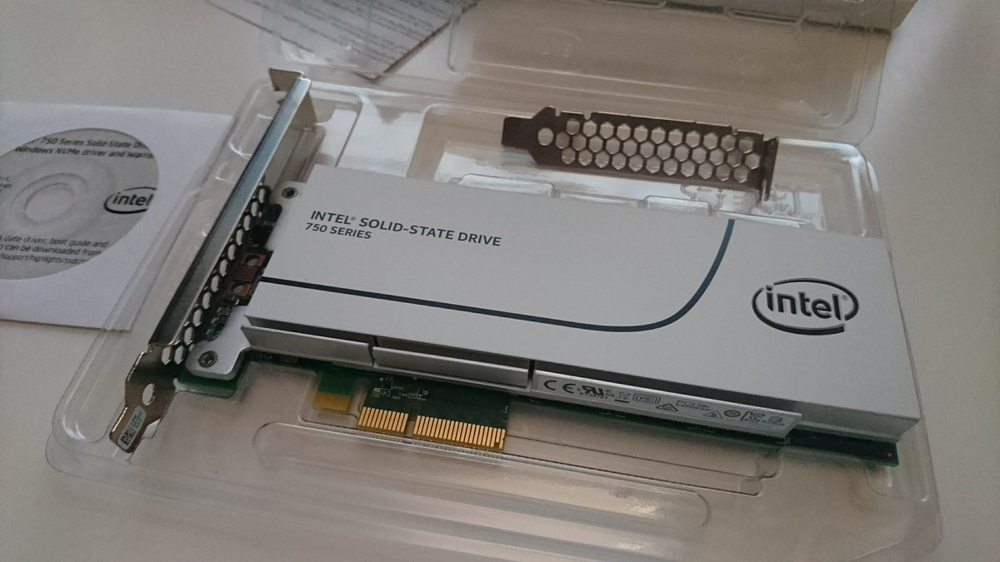
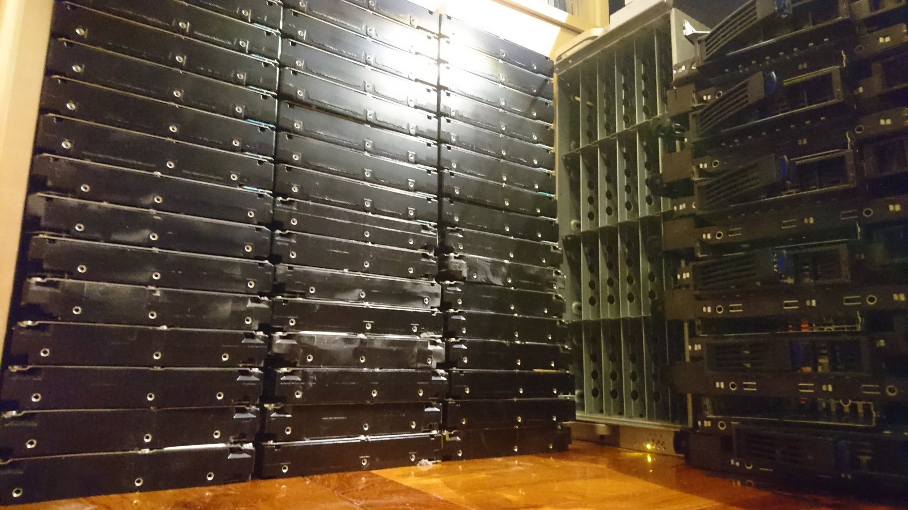
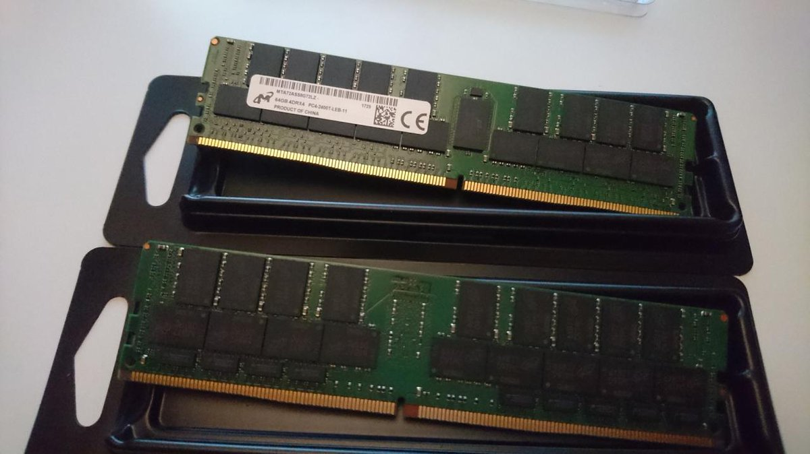

Building Anime Scene Search Engine
===

#### Story of building and running a world-wide popular image search service: "WHAT: What Anime Is This?"

##### Presented by [@soruly](https://github.com/soruly)

###### URL of my slides
###### https://github.com/soruly/slides

---

# About Me

- Graduate from **CUHK** (BSc) Computer Science
- Former committee of **Animation and Comic Society**
- Part-time in **Oursky** before graduate
- Created **whatanime.ga**
- Game Developer in **Derivco Hong Kong** now

###### https://about.me/soruly

---

# The Motivation
[Help Identifying The Anime](http://myanimelist.net/forum/?topicid=1404673)
[Know the anime but can't find the scene](https://yuki.la/wsr/111302)
[Anime Guessing Game](https://anilist.co/forum/thread/1536/1)

### Image reverse search engines:

- [Google Image](https://images.google.com/) - Results are limited
- [TinEye](https://www.tineye.com/) - never works on anime
- [iqdb](https://iqdb.org) - tailored for doujin artwork, not anime
- [SauceNAO](https://saucenao.com/) - covers iqdb plus game CG
###### SauceNAO recently expanded its [database coverage](https://saucenao.com/status.html) to recent anime

---

# [Build_Your_Own_X](https://github.com/danistefanovic/build-your-own-x)

###### https://en.wikipedia.org/wiki/List_of_CBIR_engines

---

# Demo

###### search results on the right, anime info below is provided by [anilist.co](https://anilist.co)

---

# How does it work?

whatanime.ga has nothing to do with:
- AI
- Machine Learning
- blockchain

whatanime.ga is kind of:
- [Content-based image retrieval (CBIR)](https://en.wikipedia.org/wiki/Content-based_image_retrieval) search engine
- computer graphics program
- big data

##### Common image descriptors:
- Color Layout, Edge Histogram, Opponent Histogram, ScalableColor, etc.

###### whatanime.ga only uses Color Layout due to Hardware limitations

---

# Brief idea of Color Layout
- one of the [MPEG-7 standard](http://mpeg.chiariglione.org/standards/mpeg-7/visual) (I didn't invent this)
- Raw Image -> Partition to 8x8 blocks -> take average color of each block -> convert color space to YCbCr -> DCT transform (quantize) -> Zigzag scanning
 
- extracted image feature (fingerprint): `FQYLBAQRFgoYFBANEBIQDw0QCw0PDxAeEhEQDhAfDQ8PEA8=`
###### https://en.wikipedia.org/wiki/Color_layout_descriptor

---

# Color Layout for each frame
Raw Video -> Extract all frames by **ffmpeg** -> Extract image features by **LIRE** -> Deduplicate hashes -> Append timestamp -> Load into **solr** (database)

# 
`image similarity = similarity of two binary strings`

---

# Comparing image features, at scale
- 30000+ hours of video (~2,600,000,000 frames)
- Deduplicate frames with a running window
- There are still ~804,000,000 images to compare
- Reduce search area by [Locality Sensitive Hashing](https://en.wikipedia.org/wiki/Locality-sensitive_hashing)
- Comparing ~800 million strings -> compare ~1 million strings
# 
###### still not fast enough

---

# Comparing image features, at scale

- Choose 1 out of 100 hash terms for search, starting from the least populated one. (image: cluster ID vs population)
- dermotte (author of **LIRE**) accepted this idea and [implemented this as IDF into liresolr](https://github.com/dermotte/liresolr/commit/4d500548c8e34f245de440e810bf0893e87ddbe9) (see more in [semanticmetadata.net](http://www.semanticmetadata.net/2016/03/04/lire-use-case-what-anime-is-this/))

 
###### June 2016: ~1k of daily users, search time varies from 1-40sec

---

# Image search, at scale, with speed
- Cache search results in [redis](https://redis.io/)
- Reduce search accuracy
- Disable swap
- Replace SATA SSD with NVMe SSD

###### June 2017: ~2k of daily users, search time varies from 1-30sec

---

# Data keeps growing, Traffic keeps rising

###### ~~"We need to build a wall"~~
###### Minimum search time becomes 10-30sec, server keeps overloading

---

# More Cores, More RAM

- Old server: just a quad-core Desktop PC with 32GB RAM
- New server: 2 x E5-2696v4 (44 Core 88 Threads), 256GB RAM

###### Dec 2017: Slightly better, but server still keeps overloading

---

# Squeezing All CPU Powers
- **liresolr** is single thread... and **solrcloud** does not work well with plugin schemas
- Split index into 32 [smaller databases (solr cores)](https://twitter.com/soruly/status/982954746016223232)
- Balance cores by loading hashes into least populated cores
- Search all databases in parallel, and combine results
- All database (solr cores) are hosted in one server

###### April 2018: [See how it utilize all cores](https://twitter.com/soruly/status/982953644562595840)

---

# More RAM
- [Database size (index) is 150GB now](https://whatanime.ga/about)
- Use [vmtouch](https://hoytech.com/vmtouch/) to keep the database in RAM

https://twitter.com/soruly/status/1030122636725051392

###### Aug 2018: Search time consistantly 0-2sec

---

# Auto black border detection and crop
- Using [findContours](https://docs.opencv.org/2.4/doc/tutorials/imgproc/shapedescriptors/find_contours/find_contours.html) from OpenCV to [crop black borders](https://twitter.com/soruly/status/930080021502291968)

###### similarity: with black border 89.4%, without border 96.3%

---

# System Overview

---

## All parts of whatanime.ga are open source!

https://github.com/soruly/whatanime.ga
https://github.com/soruly/whatanime.ga-WebExtension
https://github.com/soruly/whatanime.ga-telegram-bot
https://github.com/soruly/anilist-crawler
https://github.com/soruly/anilist-chinese
https://github.com/soruly/liresolr
https://github.com/soruly/sola

#### API Docs:
https://soruly.github.io/whatanime.ga

###### 「你不需要很厲害才能開始，但不開始就沒辦法很厲害」
###### It's time to build your own Anime/Video Scene Search Engine!

---

# Future Plans

whatanime.ga will not:
- cover comics / artworks
- allow search by timecode
- increase duration of preview
- add ads to websites

whatanime.ga will:
- Increase database coverage (fill in missing anime and maybe crawling from youtube)
- Reduce duplicates in database
- Support multiple image descriptors like FCTH (Fuzzy Color and Texture Histogram)
- Rebuild web front-end for language and mobile support
- move to a new domain (considering trace.moe)

---

# Get Involved!

If you love whatanime.ga , share it!

Report bugs on [GitHub](https://github.com/soruly), [Telegram](https://t.me/soruly) or [Discord](https://discord.gg/K9jn6Kj)

Support soruly on Patron
- https://www.patreon.com/soruly

Support soruly via PayPal
- https://www.paypal.me/soruly

Join official pages / channels:
- [Discord Channel](https://discord.gg/K9jn6Kj)
- [Telegram Channel](https://telegram.me/whatanimeupdates)
- [Facebook Page](https://www.facebook.com/whatanime.ga)
- [Google+](https://plus.google.com/communities/115025102250573417080)

---

# Credit

- Dr. Mathias Lux for [LIRE Project](http://www.lire-project.net) and [liresolr](https://github.com/dermotte/liresolr)
- Josh for providing anilist.co info via [Anilist API](https://github.com/AniList/ApiV2-GraphQL-Docs)
- [bちゃん](https://twitter.com/b123400), [Desmond](http://desmonding.me), [FangzhouL](http://imvery.moe/), Snadzies, WelkinWill, [yuriks](https://twitter.com/yuriks), and 16 other Patrons
- [ccd0](https://github.com/ccd0) for integrating whatanime.ga into [4chan-x](https://github.com/ccd0/4chan-x)
- [Xamayon](https://twitter.com/SauceNAO) for integrating whatanime.ga into saucenao.com
- [egoist](https://github.com/egoist) for [docute](https://github.com/egoist/docute) that makes API docs
- [bestshow](https://github.com/bestshow) for reporting an [XSS issue](https://github.com/soruly/whatanime.ga/issues/8) regarding [CVE-2017-6390](http://www.cvedetails.com/cve/CVE-2017-6390/)
- fans that help me to answer questions on discord
- whoever shared, complained and made suggestions
- whoever bring anime to this world ❤

---

# Thank you!
 
 

https://about.me/soruly
https://twitter.com/soruly
https://telegram.me/soruly
https://www.instagram.com/soruly

##### See more awesome ACG projects:
https://github.com/soruly/awesome-acg