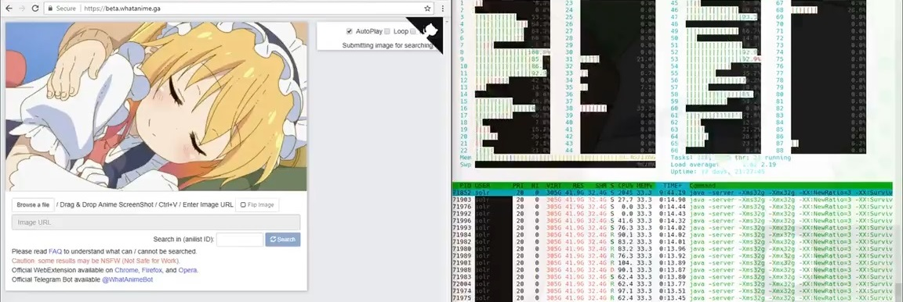

<!---->

# 追蹤動畫截圖出處的搜尋引擎

#### #CBIR #solr #BigData #ComputerGraphics

###### trace.moe 作者 [@soruly](https://github.com/soruly)

 

###### 投影片 URL https://github.com/soruly/slides

---

# 起因

- [論壇上求出處的請求](http://myanimelist.net/forum/?topicid=1404673)
- [知道是哪套動畫，但忘了哪一集](https://yuki.la/wsr/111302)
- [猜動畫出處的遊戲](https://anilist.co/forum/thread/1536/1)

### 以圖搜尋的搜索引擎:

- [Google Image](https://images.google.com/) - 只找到著名的畫面
- [TinEye](https://www.tineye.com/) - 沒有涵蓋動漫
- [iqdb](https://iqdb.org) - 只針對靜態畫作(如 Pixiv)，沒有索引動畫
- [SauceNAO](https://saucenao.com/) - 涵蓋 IQDB 及遊戲 CG，當年還沒有加入動畫 （[現在有了](https://saucenao.com/status.html)）

---

# 示範

[https://trace.moe](https://trace.moe)

###### 搜尋結果在右邊，顯示動畫名稱、集數、出現時間，下邊的動畫詳細資料是由[anilist.co](https://anilist.co)提供

---

# 運作原理

trace.moe 是一種基於內容的圖像搜尋引擎

- [Content-based image retrieval (CBIR)](https://en.wikipedia.org/wiki/Content-based_image_retrieval)
- 圖像處理程式
- 大數據

跟 AI, Machine Learning 完全沒有關係

##### 普遍的圖像描述方式:

- Color Layout, Edge Histogram, Opponent Histogram, ScalableColor, 等等.

###### trace.moe 使用 Color Layout 的主因:

- 硬體需求比較低
- 對於動畫來說，顏色是一個顯著特徵，色調普遍比較鮮明
- Color Layout 能刪除更多的重覆的畫面，減少資料庫大小

---

# Color Layout 概念

- 是一個既定標準 [MPEG-7 standard](http://mpeg.chiariglione.org/standards/mpeg-7/visual)
- 原圖 -> 分成 8x8 格 -> 計算每格顏色平均值 -> 換算成 YCbCr 色域 -> DCT 變換 -> 量化 (quantize) -> Zigzag 排列成線性
-  
- 提取出來的圖像特徵 (image hash): `FQYLBAQRFgoYFBANEBIQDw0QCw0PDxAeEhEQDhAfDQ8PEA8=`

###### https://en.wikipedia.org/wiki/Color_layout_descriptor

- Cryptographic hash (如 MD5, SHA) => 對原資料改動很敏感
- Image Hash (如 Color layout) => 對原資料改動有抵抗性

---

# 利用 LIRE 作影片分析

[LIRE](http://www.lire-project.net/) 本身已經實現了多種 Image Hash，可以批量分析圖檔

原影片 -> 用**ffmpeg**以 24 幀提取畫面 -> 用**LIRE**計算圖像特徵 -> 除去重覆的 Hash -> 補上時間軸 -> 加載到 **solr** 資料庫

# 

`圖像相似度 = 兩個HASH的相似度` (1 - [Edit Distance](https://en.wikipedia.org/wiki/Edit_distance))

---

# 對比海量圖像特徵

- 40,000 小時動畫大約有 ~3,456,000,000 幀
- 使用 [24 幀的 running window](https://github.com/soruly/sola/blob/develop/src/lib/load.js#L35) 去除重覆 Hash
- 仍需要比對約 ~977,000,000 個 hash
- 使用[Locality Sensitive Hashing](https://en.wikipedia.org/wiki/Locality-sensitive_hashing)減少搜尋空間
- 只需要比對 1~2 百萬個 hash

# 

---

# Locality Sensitive Hashing

- LSH 是用來加速近似搜尋的另一層 Hash (可想像為 hash tag)
- 分佈並不平均, 有些群集比較大 (小至幾萬，大至幾億)
- 從最小的群集開始找 (因為最快)，找到滿意的結果就停
- **LIRE**作者[把這種方法命名為 IDF 並加到新版的 liresolr](https://github.com/dermotte/liresolr/commit/4d500548c8e34f245de440e810bf0893e87ddbe9) (ref: [semanticmetadata.net](http://www.semanticmetadata.net/2016/03/04/lire-use-case-what-anime-is-this/))

---

# 盡用所有 CPU

- **liresolr** 是單線程的
- 把 1 個大資料庫分成 32 小份 [(solr cores)](https://twitter.com/soruly/status/982954746016223232)
- 把 hash 寫入當時體積最小的，讓每小份的大小相若
- 32 個資料庫仍然運行在在同一台伺服器
  

###### [https://twitter.com/soruly/status/982953644562595840](https://twitter.com/soruly/status/982953644562595840)

---

# 記憶體管理

- [資料庫體積目前是 183GB](https://trace.moe/about)
- 關掉記憶體分頁 (SWAP)
- 使用 [vmtouch](https://hoytech.com/vmtouch/) 把檔案鎖在 RAM (OS Cache)
  

---

# 其他優化方法

- 更多 CPU, 更多 RAM!!
- 降低搜尋準確度 (cutoff)
- 用 NVMe SSD 取代 SATA SSD
   

###### 現役的 2 x E5-2696v4 (44C88T @ 3.7GHz), 512GB RAM

---

# 自動幀測及裁剪黑邊

- 使用 OpenCV 的 [findContours](https://docs.opencv.org/2.4/doc/tutorials/imgproc/shapedescriptors/find_contours/find_contours.html) 來[裁剪黑邊](https://twitter.com/soruly/status/930080021502291968)
  

###### 有黑邊前的相似度是 89.4%, 刪除黑邊後的相似度是 96.3%

# 影片預覽

若要取得這搜尋結果的預覽 `Shelter, episode 1, timecode: 00:00:51.83`

| 固定前N秒後M秒          | 從那一個鏡頭開始到完結  |
|:---------------------:|:--------------------:|
|  |  |
| 00:50.93 (-0.9) to 00:53.93 (+2.1)  | 00:49.22 to 00:51.30 (dynamic) |

固定前後幾秒的做法，使用者能用下一個鏡頭的畫面再搜尋，進而看到更多的預覽部份

# 自動幀測及裁輯一個鏡頭

- 把每幀所有像素的數值加起來，變成一個數字
- 從中間開始找向前後找，直到數值突變超過某(固定)閾值
- 準確度可達87%(不能再高了
- 目前只用在 Telegram Bot，沒用在 Web

###### 參看[trace.moe-media](https://github.com/soruly/trace.moe-media/)

---

# 系統概觀

---

## 所有 trace.moe 相關的項目都是開源的

- https://github.com/soruly/trace.moe
- https://github.com/soruly/trace.moe-WebExtension
- https://github.com/soruly/trace.moe-telegram-bot
- https://github.com/soruly/trace.moe-media
- https://github.com/soruly/anilist-crawler
- https://github.com/soruly/anilist-chinese
- https://github.com/soruly/liresolr
- https://github.com/soruly/sola

#### API 文檔:

https://soruly.github.io/trace.moe

---

# 未來計劃

- 自動索引 Youtube 上的影片
- 移除重覆的影片
- 支持其他 Image Hash , 例如 FCTH (Fuzzy Color and Texture Histogram)
- Cloud Native(?)

---

# 鳴謝

- 開發 [LIRE](http://www.lire-project.net) 及 [liresolr](https://github.com/dermotte/liresolr) 的 Dr. Mathias Lux
- 提供的 [Anilist API](https://github.com/AniList/ApiV2-GraphQL-Docs) 的 Josh
- 一群持續支助項目的 Patrons
- 開發 [4chan-x](https://github.com/ccd0/4chan-x) 的 [ccd0](https://github.com/ccd0)
- SauceNAO 作者 [Xamayon](https://twitter.com/SauceNAO)
- 開發 [docute](https://github.com/egoist/docute) 的 [egoist](https://github.com/egoist)
- 給我回報了 [CVE-2017-6390](http://www.cvedetails.com/cve/CVE-2017-6390/) [XSS 報告](https://github.com/soruly/trace.moe/issues/8) 的 [bestshow](https://github.com/bestshow)
- 在 discord 上替我協助其他人的粉絲
- 那些曾分享過、批評過、給過我建議的人
- 把動畫到這世界的人 ❤

---

# 官方頻道/群組

- [Patrons](https://www.patreon.com/soruly)
- [Discord Channel](https://discord.gg/K9jn6Kj)
- [Telegram Channel](https://telegram.me/whatanimeupdates)
- [Facebook Page](https://www.facebook.com/httpstracemoe/)

## 聯繫我

- https://about.me/soruly
- https://twitter.com/soruly
- https://telegram.me/soruly
- https://www.plurk.com/soruly
- https://www.instagram.com/soruly

##### 發現更多 ACG 項目 https://github.com/soruly/awesome-acg
