<style>
footer {
  color: #999;
  font-size: 12px;
}
</style>

# Anime Scene Search Engine (2020)

##### from whatanime.ga to [trace.moe](https://trace.moe)

##### 5 years up and running

###### by [@soruly](https://github.com/soruly)

---

### Brief History

2015: whatanime.ga went online

2016: Web Extension, Telegram Bot

2017: whatanime.ga API, black border crop, video preview for Telegram Bot

2018: changed domain to [trace.moe](https://trace.moe), new server, natural scene cutting, released sola

2019: webpage front-end rewrite, speed optimization, doubled RAM, trace.moe API update

###### All presentations slides: [https://github.com/soruly/slides](https://github.com/soruly/slides)

---

### how it started (2017)

- 1 million pageviews
- 5k Chrome Extension users
- 40k monthly active users, 2k daily users
- 8k monthly search from the Telegram Bot

---

### how it's going (2020)

- 9 million pageviews (GA)
- 4 million search served by Telegram Bot
- 2.2+ million API search served for 3rd party apps/bots
- 9k Web Extension users (8k Chrome, 1k Firefox) (GA)
- 100k monthly active users, 5k daily users (GA)
- 300k monthly unique visiters, 15k daily (Cloudflare)
- 47k daily search (26k web, 21k API) (Cloudflare)

---

### Website: How it started (Nov 2015)

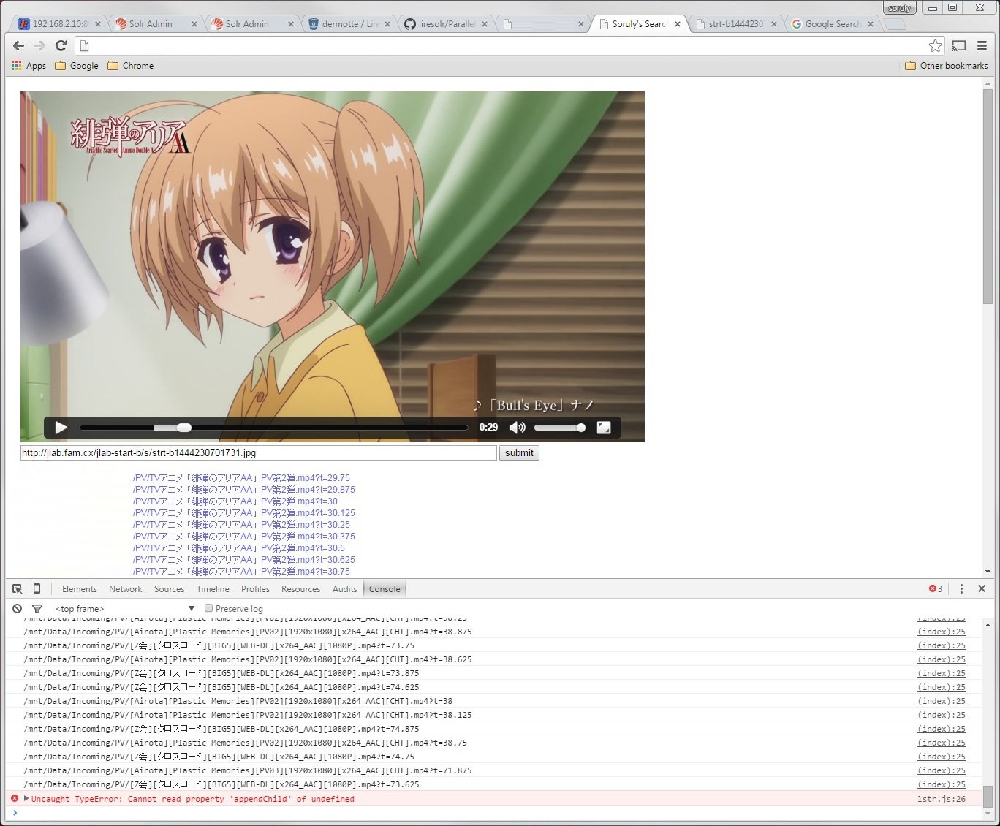

###### First prototype. A magic website that turns screenshot to video

---

### Website: How it started (Dec 2015)

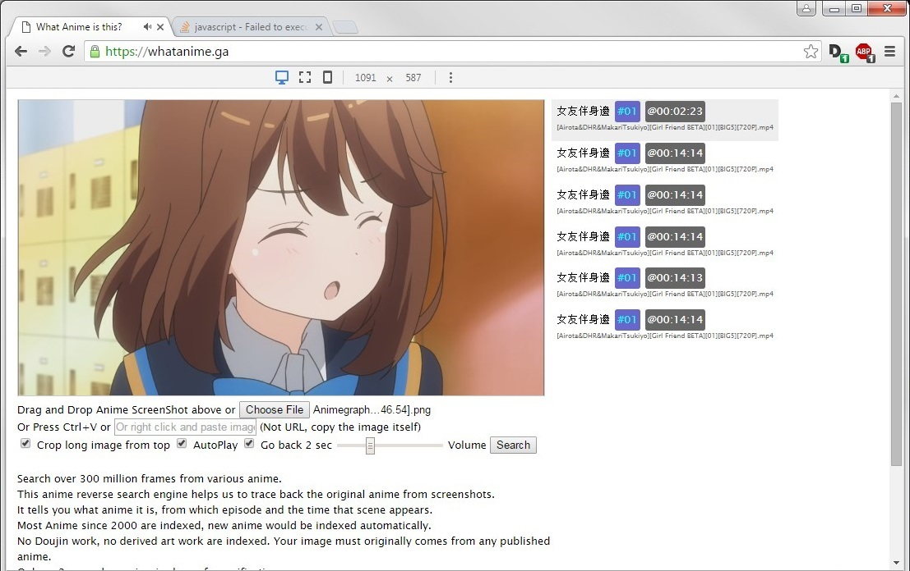

###### Went public with domain whatanime.ga

---

### Website: How it started (Dec 2015)

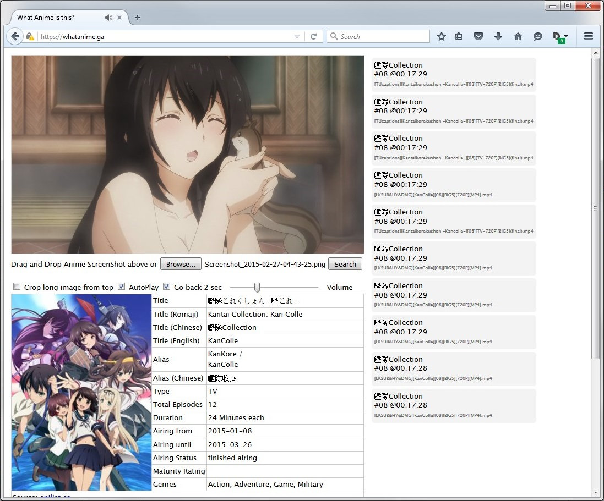

###### Add Anilist info

---

### Website: How it's going (Dec 2020)

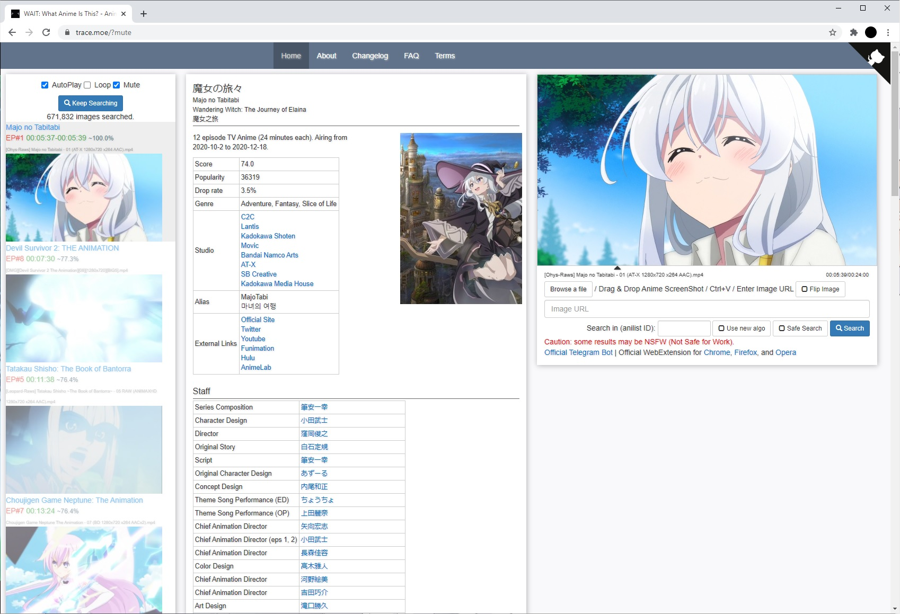

---

### Updates in 2020

###### (including updates in late 2019)

- +117.42% more users, +120.66% page views YoY
- dark mode
- new image proxy
- new image search algorithm (JCD)
- removed duplicated and subbed anime
- new hard disks, router, switch and cases
- automatic fail-over network
- trace.moe API update
  - search by file upload / POST / URL
  - search by image / video
  - removed quota limit

---

### Image Descriptors Experiments (2017)

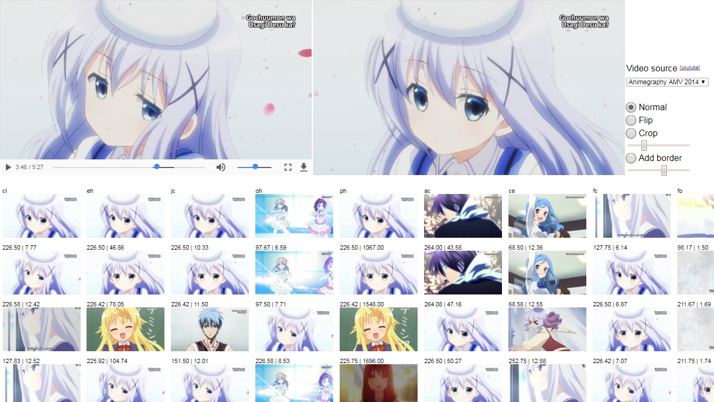

---

### New image search algo (JCD)

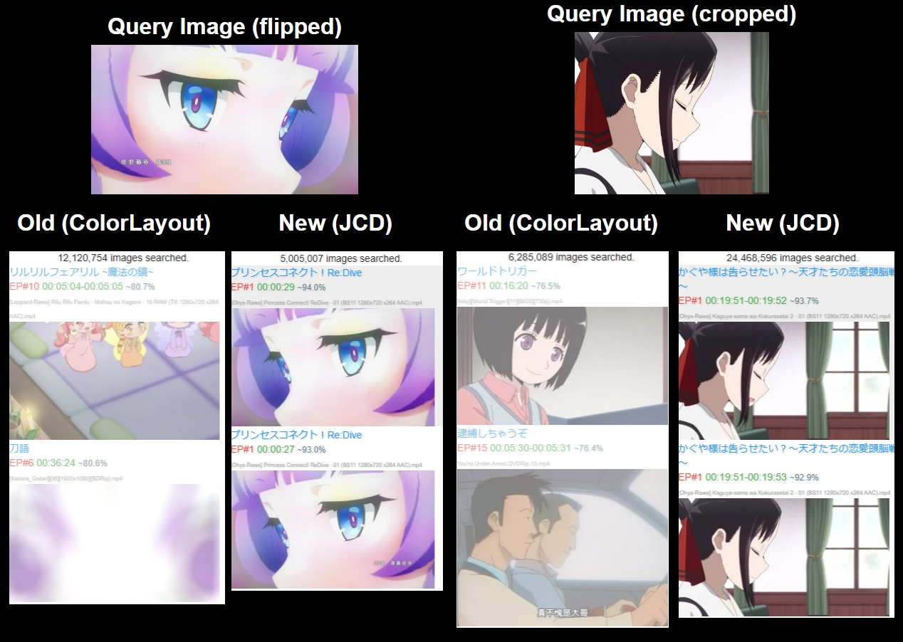

---

### Image Proxy

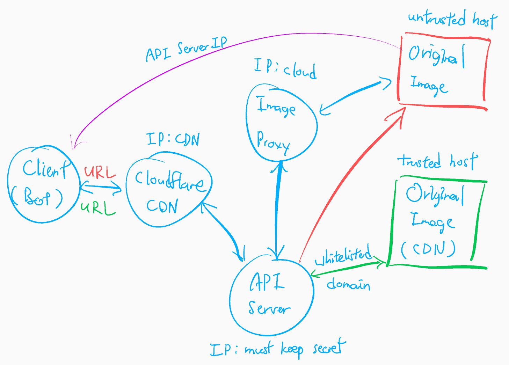

###### Image Proxy: Linode => Vercel (Zeit Now) => Cloudflare Workers

---

### Bots: Facebook

Terminated in 2016 before release

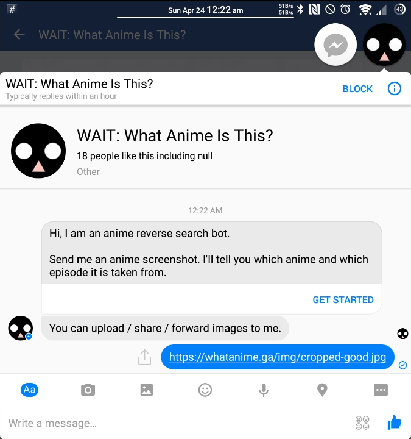

---

### Bots: Telegram

https://t.me/whatanimebot

Developed and maintained by soruly

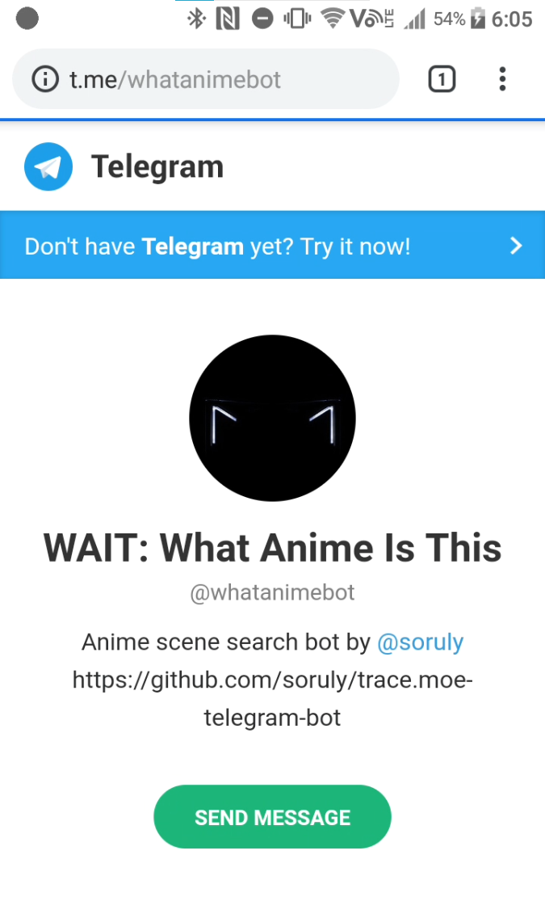

Hidden commands: `mute`, `jc`

---

### Bots: Discord (3rd party)

Developed and maintained by Uriel

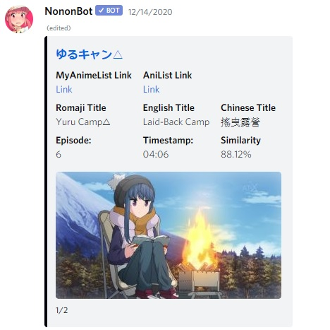

---

### API

- Form POST / File upload / URL in query string
- Image / Video support
- Quota limit removed (No need to ask for API tokens)

```
[soruly@sophie ~]$ curl -s https://trace.moe/api/search?url=https://images.plurk.com/5WiD61rYPJjd54rZ84bxJ7.png | jq '.docs[0]'
{
  "from": 321.92,
  "to": 323.83,
  "anilist_id": 112609,
  "at": 323.33,
  "season": "2020-10",
  "anime": "魔女之旅",
  "filename": "[Ohys-Raws] Majo no Tabitabi - 12 END (AT-X 1280x720 x264 AAC).mp4",
  "episode": 12,
  "tokenthumb": "9w_99Sl0J78Wy66yTMNpaA",
  "similarity": 0.9758578643762691,
  "title": "魔女の旅々",
  "title_native": "魔女の旅々",
  "title_chinese": "魔女之旅",
  "title_english": "Wandering Witch: The Journey of Elaina",
  "title_romaji": "Majo no Tabitabi",
  "mal_id": 40571,
  "synonyms": [
    "MajoTabi",
    "마녀의 여행"
  ],
  "synonyms_chinese": [],
  "is_adult": false
}
[soruly@sophie ~]$
```

---

### Data

#### how it started (2016)

2395 anime series
15600 hours
~8.4TB
414 Million frames indexed, 76GB in DB (ColorLayout)

#### how it's going (2020)

5162 anime series
29256 hours
~21TB
1.7 Billion frames indexed, 428GB in DB (ColorLayout+JCD)
(0.7B;133GB for ColorLayout, 1B;294GB for JCD)

---

### Server: how it started

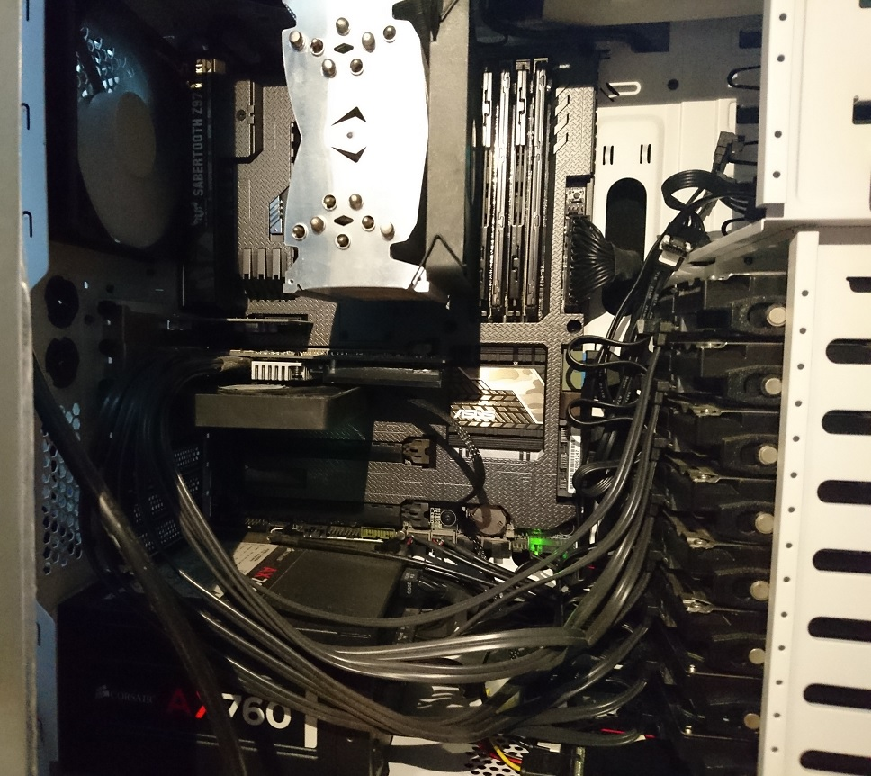

###### Core i7-4790 (4 Cores), 32GB RAM, 8x4TB HDD 1G LAN

---

### Server: how it's going

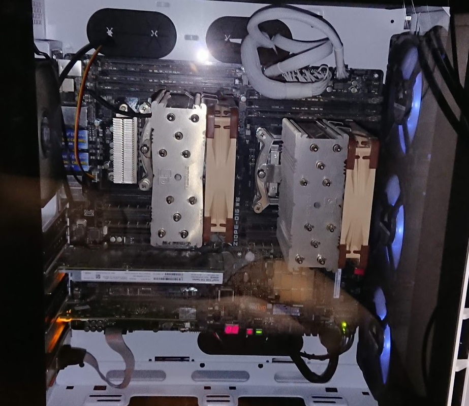

###### 2 x E5-2696v4 (44 Cores), 512GB RAM, 3x16TB HDD, 10G LAN

---

### New network equipments

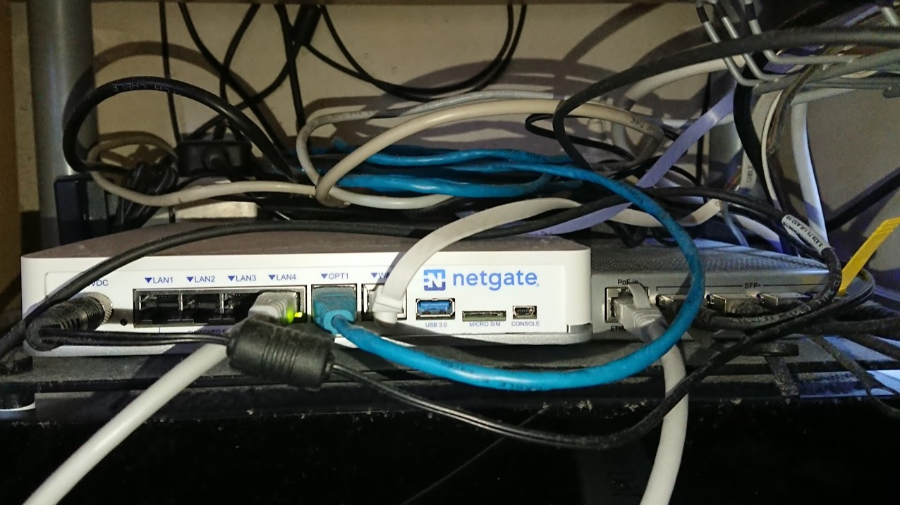

###### Left: Netgate SG-3100, Right: MIKROTIK CRS305-1G-4S+IN

---

### Automatic fail-over network

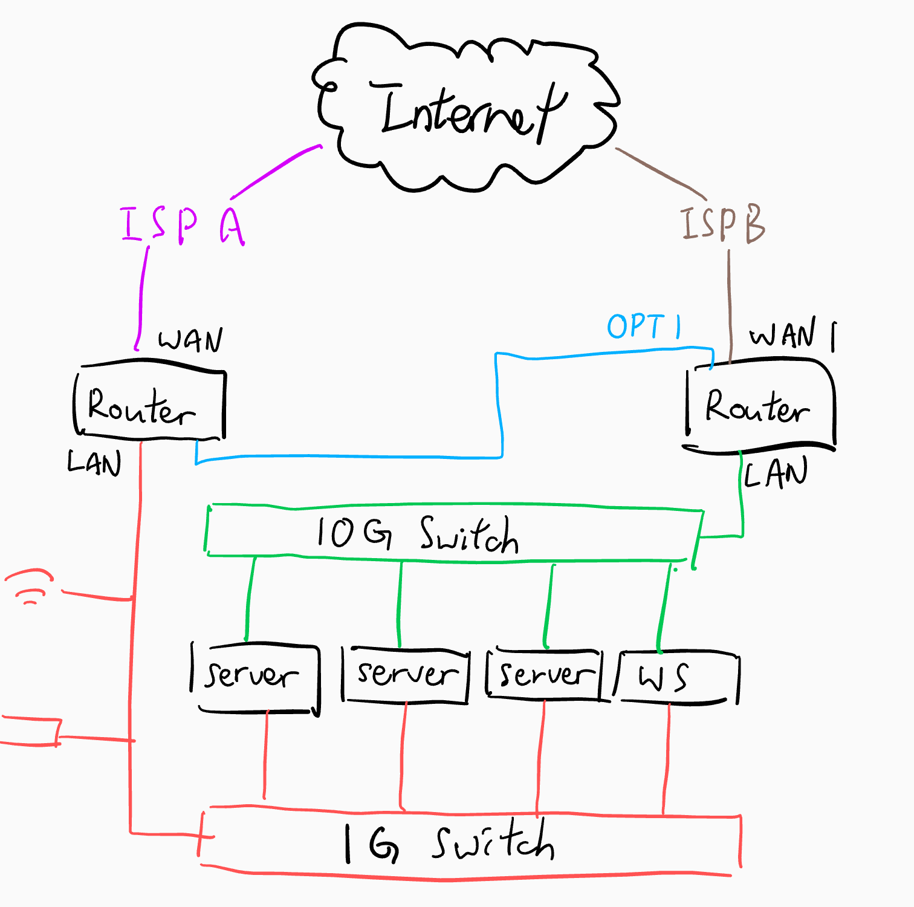

###### Several network outage in May 2020; saved one on 5 Nov

---

### Costs

- Monthly costs: ~$110/month
  - Power: ~$64/month
  - Network: ~$24/month
  - CDN: ~$20/month
  - Domain: ~23.14/year

###### Total Hardware costs: >$5000

##### Total Donations over 5 years: $5738.66 ($5183.44 received)

---

### Previously Planned Works

- badly written sourcecode ✅
- cleaned up misplaced anime ✅
- AniList APIv2 ✅
- Develop a Firefox Add-on ✅
- Wait for facebook to approve the Messenger Bot ❌
- Develop more IM bots ❌
- New image descriptor FCTH (chosen JCD instead) ✅
- Upgrade to latest version of liresolr ✅
- Re-index everything for accurate timecode ✅

---

### Previously Planned Works

- Buy a faster server ✅
- Move to new domain ✅
- Rebuild web front-end (dark mode and mobile) ✅
- Users accounts, bookmark a scene ❌
- Tutorials for setting up and running the system locally ✅
- Better communication with whoever interested (e.g. blog, channel, chatroom...) 🥴
- Increase database coverage ✅
- Reduce duplicates in database ✅

---

### New Planned Works

- Test cases
- Migrate from PHP to nodejs or something else
- Cross reference results from ColorLayout and JCD
- Search queue w/ priority
- Migrate to cloud partially
- New server

---

### Project URLs

- https://github.com/soruly/trace.moe
- https://github.com/soruly/trace.moe-WebExtension
- https://github.com/soruly/trace.moe-telegram-bot
- https://github.com/soruly/trace.moe-media
- https://github.com/soruly/trace.moe-image-proxy
- https://github.com/soruly/anilist-crawler
- https://github.com/soruly/anilist-chinese
- https://github.com/soruly/liresolr
- https://github.com/soruly/sola

---

### Official Channels

- Patron: https://www.patreon.com/soruly
- Discord: https://discord.gg/K9jn6Kj
- Telegram: https://telegram.me/whatanimeupdates
- [Facebook Page](https://www.facebook.com/httpstracemoe/) (abandoned)
- ~~[Google+](https://plus.google.com/communities/115025102250573417080)~~ shuted down

---

### Credits

- Dr. Mathias Lux for [LIRE Project](http://www.lire-project.net) and [liresolr](https://github.com/dermotte/liresolr)
- [anilist.co](https://anilist.co/home) for providing anime info via [Anilist API](https://github.com/AniList/ApiV2-GraphQL-Docs)
- Uriel for managing the Discord Channel and Discord Bot
- Sponsors from Patreon, GitHub and Paypal
- fans who helped answering questions in various channels
- friends who reported bugs and issues to me

---

### 自己紹介

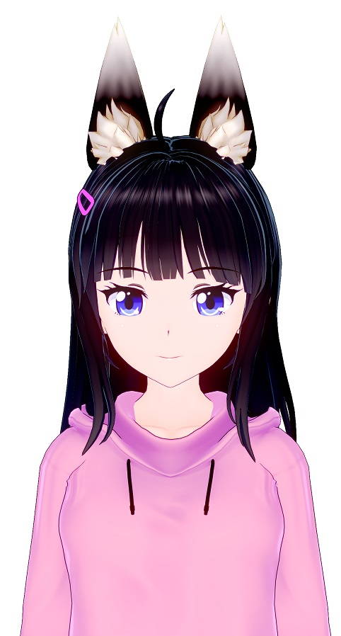

名前：soruly
そ ↓ ル ↑ リ ↑ です(>\_<)

年齢：１８＋
身長：１５５ｃｍ
体重：とにかく軽い

好きな物:
日常系アニメ、音ゲー、プログラミング、甘いもの、ふわふわもの

https://about.me/soruly
